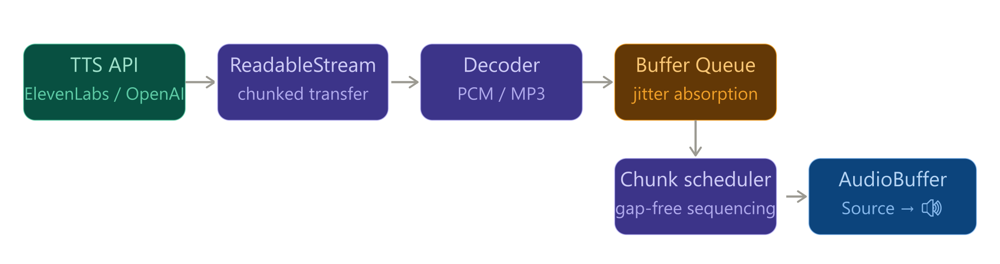

# tts-stream-player

A minimal browser library for streaming TTS audio playback via the Web Audio API.

Bridges the gap between TTS API responses (chunked transfer encoding) and the browser speaker — the part that SDKs like ElevenLabs and OpenAI leave unimplemented on the client side.

## Overview

Cloud TTS APIs stream audio over HTTP using chunked transfer encoding. Without streaming playback, the browser must wait for the entire audio to be generated before it starts playing — adding 5–10 seconds of silence in a typical 400-character response.

With `tts-stream-player`, the first audio chunk plays within ~100–500ms of the API response starting.



## Features

- PCM 16-bit streaming playback via Web Audio API
- Seamless chunk scheduling (no gaps between chunks)
- Time-based buffer queue for absorbing network jitter
- Underflow recovery — automatically rebuffers and resumes after network stalls
- Safari autoplay unlock helper
- Per-session `start` / `end` / `buffering` event hooks
- Session cancellation and global interrupt

## Installation

```bash
npm install tts-stream-player
```

## Usage

```typescript
import { TTSStreamPlayer } from 'tts-stream-player'

const player = new TTSStreamPlayer({
  sampleRate: 16000,
  channels: 1,
  minBufferMs: 150, // start playback after 150ms of audio is buffered
})

// Call inside a user gesture (click, tap)
startButton.addEventListener('click', async () => {
  await player.unlock()

  const response = await fetch('/api/tts', {
    method: 'POST',
    body: JSON.stringify({ text: 'Hello, world.' }),
  })

  const session = await player.play(response.body)

  session.on('start',     () => console.log('playing'))
  session.on('buffering', () => console.log('rebuffering...'))
  session.on('playing',   () => console.log('resumed'))
  session.on('end',       () => console.log('done'))
})

// Interrupt immediately (e.g. user starts speaking)
micButton.addEventListener('click', () => {
  player.interrupt()
})
```

## API

### `new TTSStreamPlayer(options)`

| Option | Type | Required | Description |
|---|---|---|---|
| `sampleRate` | `number` | yes | Sample rate of the PCM stream (e.g. `16000`, `24000`) |
| `channels` | `number` | no | Number of channels. Default: `1` |
| `minBufferMs` | `number` | no | Milliseconds of audio to buffer before playback starts (and before resuming after underflow). Default: `100` |

### `player.unlock(): Promise<void>`

Initializes and resumes the `AudioContext`. Must be called inside a user gesture event handler (click, tap). Required for Safari and other browsers that block autoplay.

### `player.play(stream): Promise<Session>`

Starts streaming playback from a `ReadableStream<Uint8Array>`. Returns a `Session` object.

### `player.interrupt(): void`

Suspends audio output. The `AudioContext` remains alive and can be resumed.

### `session.on(event, handler): this`

| Event | When |
|---|---|
| `start` | First chunk has been scheduled for playback |
| `buffering` | Buffer exhausted mid-stream; waiting to rebuffer |
| `playing` | Rebuffering complete; playback has resumed |
| `end` | Stream has ended or session was cancelled |

### `session.cancel(): void`

Cancels this session and suspends the `AudioContext`.


## PCM format

Supports **16-bit signed PCM** (little-endian), the default output format of ElevenLabs (`pcm_16000`, `pcm_22050`, `pcm_24000`) and OpenAI TTS (`pcm`).

Make sure the `sampleRate` option matches the format requested from the API.

```typescript
// ElevenLabs example — request PCM at 16kHz
const response = await fetch('https://api.elevenlabs.io/v1/text-to-speech/{id}/stream?output_format=pcm_16000', {
  method: 'POST',
  headers: {
    'xi-api-key': API_KEY,
    'Content-Type': 'application/json',
  },
  body: JSON.stringify({
    text: 'Hello.',
    model_id: 'eleven_flash_v2_5',
  }),
})

const player = new TTSStreamPlayer({ sampleRate: 16000 })
await player.unlock()
await player.play(response.body)
```

## Browser support

Requires Web Audio API support.

| Browser | Support |
|---|---|
| Chrome | ✅ |
| Firefox | ✅ |
| Edge | ✅ |
| Safari | ✅ (unlock() required) |

## Roadmap

- **Phase 3** — MP3 and WAV format support
- **Phase 4** — Multi-session queue management

## License

MIT